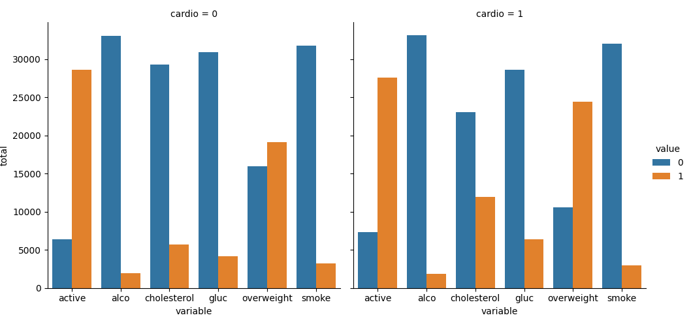
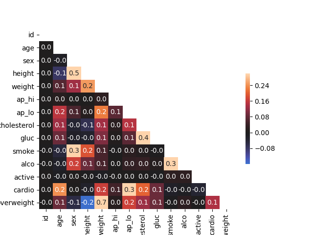

# Medical Data Visualizer

This code reads in a medical examination dataset and produces two visualizations: a categorical plot and a heatmap. 

The categorical plot shows the total number of people with a certain medical condition divided into two categories based on whether they have cardiovascular disease. The heatmap shows the correlation between different features in the dataset. 

The dataset contains information about people's height, weight, and various medical conditions, such as cholesterol and glucose levels. The code first adds a column for body mass index (BMI) and for overweight. It then normalizes the data by making 0 always good and 1 always bad for cholesterol and glucose levels. 

Next, the categorical plot is drawn using seaborn's catplot() function. This plot shows the total number of people with each medical condition, divided into two categories based on whether they have cardiovascular disease. 

Finally, the heatmap is drawn using seaborn's heatmap() function. This plot shows the correlation between different features in the dataset.

